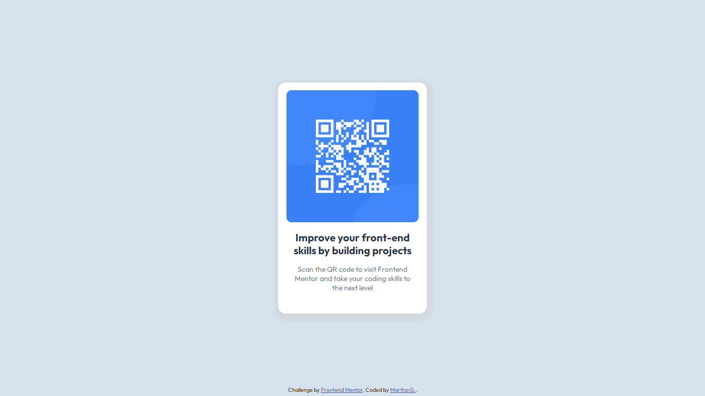

# Frontend Mentor - QR code component solution

This is a solution to the [QR code component challenge on Frontend Mentor](https://www.frontendmentor.io/challenges/qr-code-component-iux_sIO_H). Frontend Mentor challenges help you improve your coding skills by building realistic projects. 

## Table of contents

- [Overview](#overview)
  - [Screenshot](#screenshot)
  - [Links](#links)
- [My process](#my-process)
  - [Built with](#built-with)
  - [What I learned](#what-i-learned)
  - [Continued development](#continued-development)
  - [Useful resources](#useful-resources)
- [Author](#author)
- [Acknowledgments](#acknowledgments)

## Overview


### Screenshot



### Links

- Solution URL: [Repository](https://github.com/margga88/QR-Code-Component)
- Live Site URL: [Live preview](https://margga88.github.io/QR-Code-Component/)

## My process

### Built with

- Semantic HTML5 markup
- CSS custom properties
- Flexbox

### What I learned

This project has served as a quite the test for me and my knowledge, while it's a simple project it can have its share of twists when you finally stop focusing on the theory and dive into practice.

- **'noopener'**. This was a novelty for me since most courses don't mention this kind of value for the _rel_ attribute. My code editor would show an error if I refuse to add it to the ```<a>``` element. [w3schools](https://www.w3schools.com/TAGS/att_a_rel.asp) defines it as a value that: "Requires that any browsing context created by following the hyperlink must not have an opener browsing context".

- **Applications of border-radius property**. Or more like the non-applicatives of it, the property doesn't apply with the _img_ element if you use padding in any of it's sides, so, to create the space between elements is most preferrable to use the margin property. At least it's what I've found out while working on this project.

- **The importance of containers**. I cannot emphasize enough the importance of it, learn to know where to apply your containers or not. As a mental trick, visualize your HTML elements as snack packs or your _main_ element as a big table of snacks, watch what belong to which pack/bowl/plate.., peanuts with peanuts, gummy bears with gummy bears; as a visual trick, use the border property to know where they start and end.

- **The lack of teaching on the box-sizing property**. Most courses I've taken, at the time of teaching the very relevant box model on CSS, fail to present this property in visuals, and I'm not talking about showing where the content, padding, border, and margins are visually speaking, or how they're measured for the box-sizing property value, what I'm saying is that it's a very confusing thing to learn and it's worse when there are no visual examples of it at the moment of being put into action. I had to find out what that property does while solving the issues that came up in this project when making it responsive.

- **vh unit is your best friend on responsive projects**. I usually would dismiss it, as a graphic designer my _gravitas_ tends to be the pixel units, but it wasn't until this project I understood the limitations of such units (same for percentages) for some cases like the height for the _body_ element for it to be responsive, since it grants such quality for the devices that visualize the project.

- **Do not dismiss the semantic rules of HTML**. I tried to do so —to be specific— with the _footer_. It almost made a mess out of my project. Don't make my mistake.


### Continued development

- I would definitely love to go back and review the box model and the box-sizing property for some time as I advance in other projects, possibly starting a repository of examples for other people to understand this easily.

### Useful resources

- [Mastering FrontEnd Mentor Challenge 1 QR Code Component](https://medium.com/@gorokhovgleb/mastering-frontend-mentor-challenge-1-qr-code-component-553486fad21d) - This was definitely the resource I consulted the most to solve a few issues in my code.

- [MDN Web Docs](https://developer.mozilla.org/)

- [W3Schools Online Web Tutorials](https://www.w3schools.com/)

## Author

- Frontend Mentor - [@margga88](https://www.frontendmentor.io/profile/margga88)


## Acknowledgements

I'd like to thank Gleb Gorokhov, his solution was of big help to solve the minor issues I had with my project.

